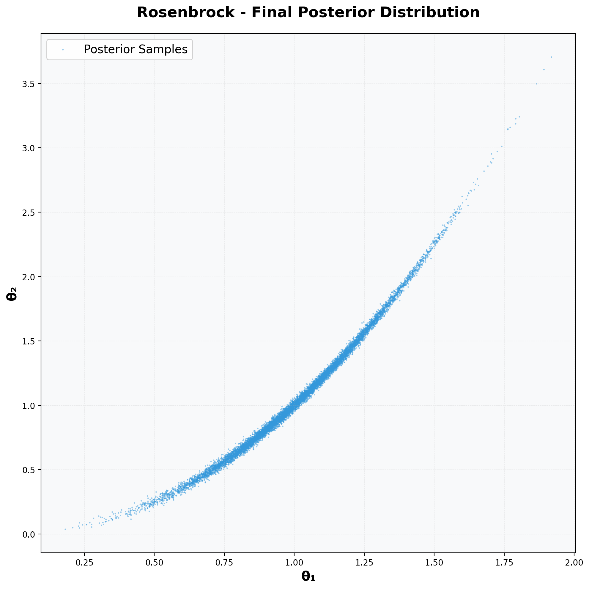
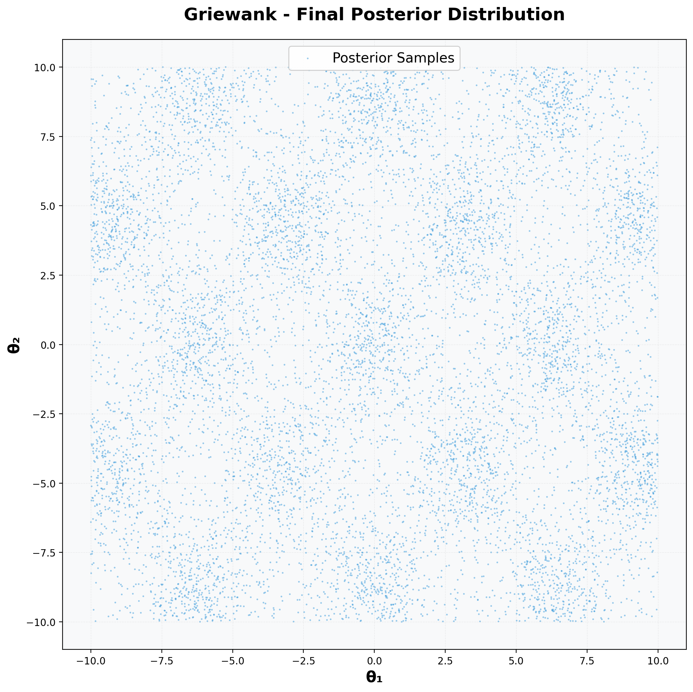
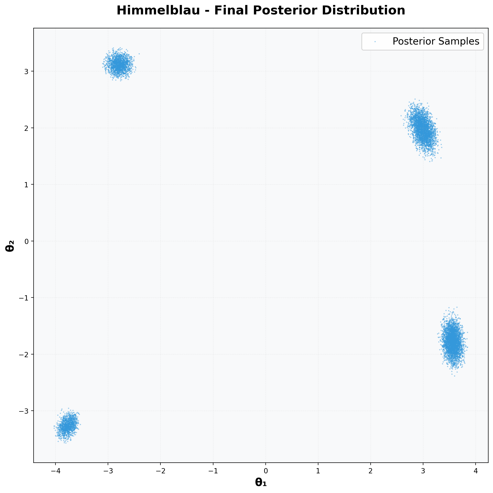
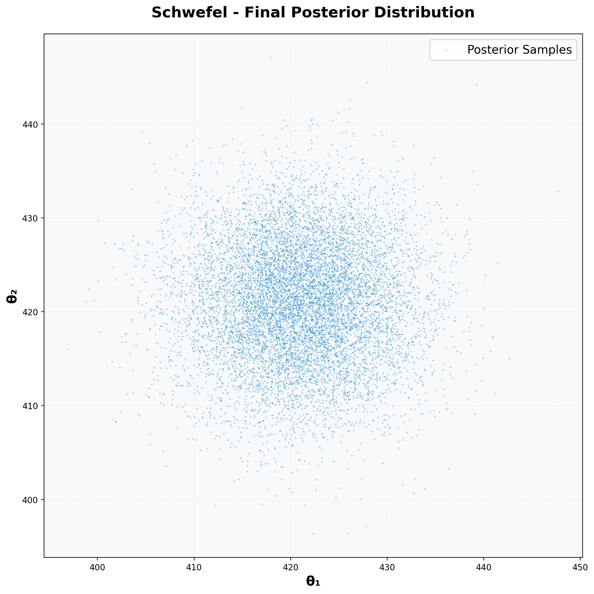
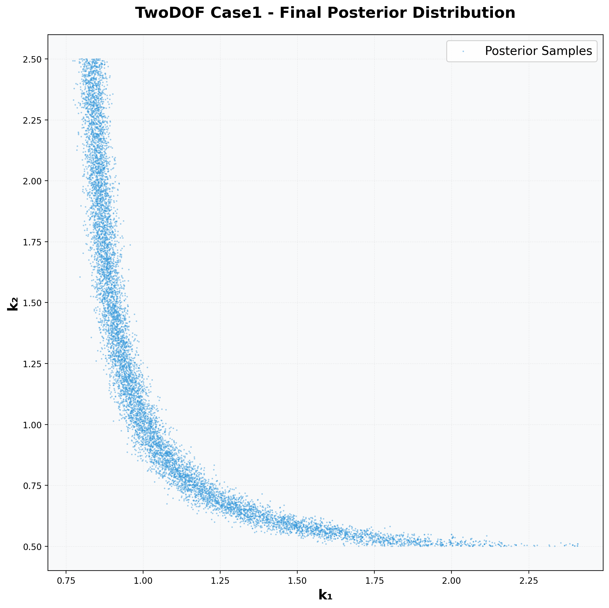
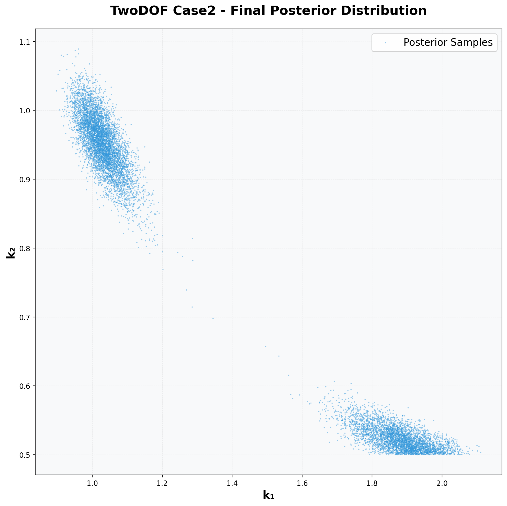
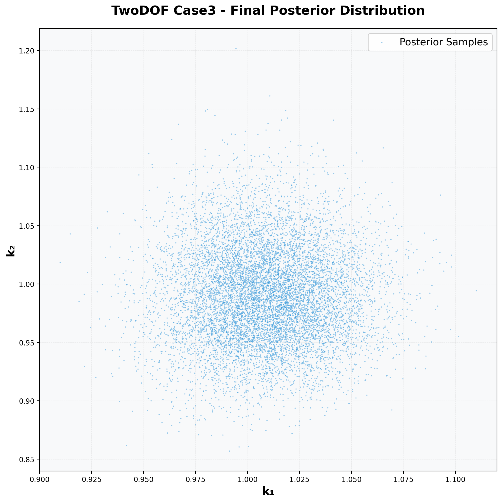

# 过渡马尔可夫链蒙特卡洛 (T-MCMC)

基于 NumPy 实现的过渡马尔可夫链蒙特卡洛方法，用于贝叶斯推断和参数识别。

## 目录

- [概述](#概述)
- [算法原理](#算法原理)
- [核心特性](#核心特性)
- [安装](#安装)
- [快速开始](#快速开始)
- [基准测试算例](#��准测试算例)
- [API 参考](#api-参考)
- [参考文献](#参考文献)

---

## 概述

过渡马尔可夫链蒙特卡洛（Transitional Markov Chain Monte Carlo, T-MCMC）是一种强大的序贯蒙特卡洛方法，专为复杂参数空间中的贝叶斯推断而设计。与标准 MCMC 方法在多峰或高维后验分布中可能遇到的困难不同，T-MCMC 引入了一个退火参数，能够实现从先验分布到后验分布的平滑过渡。

本实现提供了一个稳健、高效且易于使用的框架，适用于：
- 贝叶斯参数估计
- 结构系统识别
- 复杂函数优化
- 模型校准和不确定性量化

---

## 算法原理

### 数学基础

T-MCMC 引入退火参数 **φ ∈ [0, 1]** 来定义一系列连接先验和后验的中间分布：

```
p(θ | φ) ∝ p(θ) × L(θ)^φ
```

其中：
- **θ**: 参数向量
- **p(θ)**: 先验分布
- **L(θ)**: 似然函数
- **φ = 0**: 从先验分布采样
- **φ = 1**: 从后验分布采样
- **0 < φ < 1**: 中间过渡分布

### 算法详细流程

T-MCMC 算法包含以下阶段的迭代过程：

---

#### **第一步：初始化 (φ₀ = 0)**

从先验分布中抽取初始样本：

```
θ₀⁽ⁱ⁾ ~ p(θ),  i = 1, ..., N
```

其中 N 是马尔可夫链的数量（通常为 1000-10000）。

**目的：** 确保算法从一个无偏的起点开始，覆盖整个参数空间。

---

#### **第二步：序贯退火迭代**

对于每个阶段 j，逐步增加 φ 直到达到 φ = 1。以下是每个阶段的详细子步骤：

---

##### **2.1 自适应退火参数选择**

**目标：** 计算下一个退火参数 φⱼ₊₁，使得可信权重的变异系数（COV）接近目标值（通常为 1.0）。

**计算方法：** 使用二分法求解以下优化问题：

```
找到 φⱼ₊₁ 使得: COV(w) ≈ target_cov (默认 1.0)
```

其中变异系数定义为：

```
COV(w) = σ(w) / μ(w)
```

**具体算法：**

```python
φ_min = φⱼ        # 当前退火参数
φ_max = 2.0        # 搜索上界（最终限制在 1.0）

while |φ_max - φ_min| > 1e-8:
    φ_试探 = (φ_min + φ_max) / 2
    Δφ = φ_试探 - φⱼ

    # 计算权重
    w⁽ⁱ⁾ = L(θⱼ⁽ⁱ⁾)^Δφ
    w̃⁽ⁱ⁾ = w⁽ⁱ⁾ / Σₖ w⁽ᵏ⁾

    # 计算 COV
    COV = std(w̃) / mean(w̃)

    # 调整搜索区间
    if COV > target_cov:
        φ_max = φ_试探
    else:
        φ_min = φ_试探

φⱼ₊₁ = min(φ_试探, 1.0)
```

**物理意义：** 通过控制 COV，确保每一步的似然增量不会太大（避免权重退化）或太小（浪费计算资源）。

---

##### **2.2 可信权重计算**

根据似然值的增量计算每个粒子的重要性权重：

```
wⱼ⁽ⁱ⁾ = L(θⱼ⁽ⁱ⁾)^(φⱼ₊₁ - φⱼ)
```

**数值稳定性处理：**

为避免数值上溢/下溢，在对数空间计算：

```
log wⱼ⁽ⁱ⁾ = (φⱼ₊₁ - φⱼ) × log L(θⱼ⁽ⁱ⁾)

减去最大值以稳定计算：
log wⱼ⁽ⁱ⁾ = log wⱼ⁽ⁱ⁾ - max(log wⱼ)

归一化权重：
w̃ⱼ⁽ⁱ⁾ = wⱼ⁽ⁱ⁾ / Σₖ wⱼ⁽ᵏ⁾
```

**物理意义：** 权重反映了每个样本在新分布下的相对重要性。似然值高的样本获得更大的权重。

---

##### **2.3 有效样本大小 (ESS)**

监控采样效率，避免粒子退化：

```
ESS = 1 / Σᵢ (w̃ⱼ⁽ⁱ⁾)²
```

**ESS 的范围和意义：**
- **ESS ≈ N**: 权重几乎均匀，采样效率高
- **ESS ≪ N**: 权重集中在少数粒子，需要重采样
- **典型阈值**: ESS < N/2 时触发重采样（本实现中每步都重采样）

**理论依据：** ESS 衡量"有效"参与估计的样本数量。权重不均会导致方差增大。

---

##### **2.4 多项式重采样**

为避免粒子退化，基于权重进行重采样：

**算法：**
```python
# 基于权重 w̃ⱼ⁽ⁱ⁾ 进行多项式抽样
indices = multinomial_sample(weights=w̃ⱼ, size=N)

# 复制被选中的粒子
θⱼ₊₁⁽ⁱ⁾ = θⱼ⁽ⁱⁿᵈⁱᶜᵉˢ⁽ⁱ⁾⁾,  i = 1, ..., N

# 重置权重为均匀
w̃ⱼ₊₁⁽ⁱ⁾ = 1/N
```

**效果：**
- 权重大的样本被复制多次
- 权重小的样本可能被淘汰
- 所有样本重新获得相等权重

**代价：** 样本多样性降低（需要后续 MCMC 步骤恢复）

---

##### **2.5 MCMC 变异步骤（Metropolis-Hastings）**

对每个重采样后的粒子执行 M 步 Metropolis-Hastings 算法，以增加样本多样性：

**提议分布：**

根据当前阶段样本的加权协方差构造提议：

```
Σⱼ = Σᵢ w̃ⱼ⁽ⁱ⁾ (θⱼ⁽ⁱ⁾ - μⱼ)(θⱼ⁽ⁱ⁾ - μⱼ)ᵀ

其中: μⱼ = Σᵢ w̃ⱼ⁽ⁱ⁾ θⱼ⁽ⁱ⁾

提议分布:
q(θ* | θⱼ⁽ⁱ⁾) = N(θⱼ⁽ⁱ⁾, β² Σⱼ)
```

**MH 接受概率：**

在退火分布 p(θ | φⱼ₊₁) 下进行 MH 采样：

```
目标分布: π(θ) = p(θ) L(θ)^φⱼ₊₁

接受概率:
α = min(1, π(θ*) / π(θⱼ⁽ⁱ⁾))
  = min(1, [p(θ*) L(θ*)^φⱼ₊₁] / [p(θⱼ⁽ⁱ⁾) L(θⱼ⁽ⁱ⁾)^φⱼ₊₁])
```

**算法流程（对每个粒子）：**

```python
for step in range(M):  # M 通常为 10-50
    # 生成提议
    θ* ~ N(θ_current, β² Σⱼ)

    # 计算接受概率
    log_α = log p(θ*) + φⱼ₊₁ log L(θ*)
            - log p(θ_current) - φⱼ₊₁ log L(θ_current)

    # 接受/拒绝
    if log(uniform(0,1)) < log_α:
        θ_current = θ*  # 接受
        n_accept += 1
    # 否则保持 θ_current 不变
```

**目的：**
1. 恢复重采样损失的样本多样性
2. 使样本更符合当前阶段的目标分布
3. 探索参数空间

---

##### **2.6 自适应缩放因子调整**

根据 MH 步骤的接受率动态调整提议分布的缩放因子 β：

**经验公式：**

```
β = 1/9 + (8/9) × acceptance_rate
```

**理论依据：**

对于高斯提议分布，最优接受率在 **23-44%** 之间（Roberts & Rosenthal, 2001）。上述公式将接受率映射到合理的缩放范围：

- 接受率 = 0%   → β = 1/9 ≈ 0.11  （提议步长太大，缩小）
- 接受率 = 50%  → β ≈ 0.56         （接近最优）
- 接受率 = 100% → β = 1.0          （提议步长太小，增大）

**更新时机：** 每个阶段的 MCMC 完成后更新，用于下一阶段。

**优点：** 无需手动调参，算法自适应收敛到最优探索效率。

---

#### **第三步：收敛判断**

当 φⱼ ≥ 1.0 时，算法终止。此时样本代表目标后验分布 p(θ | data) 的抽样。

**终止条件：**
```
if φⱼ₊₁ ≥ 1.0:
    φⱼ₊₁ = 1.0  # 精确设为 1.0
    执行最后一次 MCMC 变异
    返回最终样本
```

---

### 算法的关键优势

#### 1. **无需预烧期（Burn-in）**
- 标准 MCMC 需要丢弃初始样本（burn-in period）
- T-MCMC 从先验开始，逐步过渡到后验，所有阶段的样本都有意义
- 计算效率更高

#### 2. **自动自适应**
- **退火参数 φ**: 根据 COV 自动选择，无需手动指定阶段数
- **缩放因子 β**: 根据接受率自动调整
- **提议协方差 Σ**: 根据当前样本自动估计
- 用户只需关注先验、似然和链数量

#### 3. **鲁棒的多峰探索**
- 通过渐进式增加似然影响，避免过早陷入局部最优
- 早期阶段（小 φ）时先验主导，样本分散在整个空间
- 后期阶段（大 φ）时似然主导，样本收敛到高概率区域
- 特别适合多峰后验分布

#### 4. **高维空间效率**
- 重采样机制聚焦高概率区域
- MCMC 变异步骤恢复样本多样性
- 加权协方差自适应参数空间的几何结构
- 可处理数十到数百维参数

#### 5. **并行化潜力**
- 每个 MCMC 链独立演化，可并行计算
- 似然评估可批量化处理
- 适合大规模计算和 GPU 加速

#### 6. **理论保证**
- 马尔可夫链满足细致平衡条件
- 收敛到正确的后验分布（遍历性）
- 有效样本大小监控确保采样质量

---

### 算法伪代码

```
输入:
  - 先验分布 p(θ)
  - 似然函数 L(θ | data)
  - 链数量 N
  - MH 步数 M

输出:
  - 后验样本 {θ⁽ⁱ⁾}ᵢ₌₁ᴺ

算法流程:
1. 初始化:
   φ₀ = 0
   θ₀⁽ⁱ⁾ ~ p(θ), i = 1, ..., N

2. while φⱼ < 1.0:

   a. 计算似然值:
      Lⱼ⁽ⁱ⁾ = L(θⱼ⁽ⁱ⁾ | data)

   b. 选择下一个退火参数:
      φⱼ₊₁ = argmin_φ |COV(L^(φ-φⱼ)) - target_cov|
      φⱼ₊₁ = min(φⱼ₊₁, 1.0)

   c. 计算权重:
      wⱼ⁽ⁱ⁾ = (Lⱼ⁽ⁱ⁾)^(φⱼ₊₁ - φⱼ)
      w̃ⱼ⁽ⁱ⁾ = wⱼ⁽ⁱ⁾ / Σₖ wⱼ⁽ᵏ⁾

   d. 计算有效样本大小:
      ESS = 1 / Σᵢ (w̃ⱼ⁽ⁱ⁾)²

   e. 重采样:
      {θⱼ₊₁⁽ⁱ⁾} ~ Multinomial({θⱼ⁽ⁱ⁾}, {w̃ⱼ⁽ⁱ⁾})

   f. 计算提议协方差:
      Σⱼ₊₁ = β² × Cov_weighted({θⱼ₊₁⁽ⁱ⁾}, {w̃ⱼ⁽ⁱ⁾})

   g. MCMC 变异 (M 步 MH):
      for i = 1 to N:
          for m = 1 to M:
              θ* ~ N(θⱼ₊₁⁽ⁱ⁾, Σⱼ₊₁)
              α = min(1, [p(θ*) L(θ*)^φⱼ₊₁] / [p(θⱼ₊₁⁽ⁱ⁾) L(θⱼ₊₁⁽ⁱ⁾)^φⱼ₊₁])
              u ~ Uniform(0, 1)
              if u < α:
                  θⱼ₊₁⁽ⁱ⁾ = θ*

   h. 自适应调整:
      acceptance_rate = n_accepted / (N × M)
      β = 1/9 + (8/9) × acceptance_rate

   i. 更新阶段:
      j = j + 1

3. 返回 {θⱼ⁽ⁱ⁾}ᵢ₌₁ᴺ
```

---

### 与其他方法的比较

| 特性 | T-MCMC | 标准 MCMC | 粒子滤波 | 变分推断 |
|------|--------|-----------|----------|----------|
| 无需 Burn-in | ✓ | ✗ | ✓ | ✓ |
| 多峰探索 | ✓ | ✗ | △ | ✗ |
| 自适应调参 | ✓ | △ | ✗ | △ |
| 高维适用 | ✓ | △ | ✗ | ✓ |
| 精确采样 | ✓ | ✓ | △ | ✗ |
| 计算成本 | 中 | 低 | 高 | 低 |

---

## 核心特性

### 灵活的先验分布

通过 scipy.stats 支持多种概率分布：
- **正态分布** (Normal)
- **均匀分布** (Uniform)
- **对数正态分布** (Log-normal)
- **Gamma 分布**
- **Beta 分布**
- **指数分布** (Exponential)

### 提议分布类型

- **高斯提议** (Gaussian Proposal):
  - 标准多元正态提议
  - 推荐用于单峰后验
  - 计算效率高

- **GMM 提议** (Gaussian Mixture Model Proposal):
  - 高斯混合模型提议
  - 推荐用于多峰后验
  - 使用 BIC 准则自动选择分量数

### 自动参数调整

- 自适应退火参数选择（目标 COV = 1.0）
- 基于接受率的自适应提议缩放
- 加权样本自动协方差估计

### 进度监控

- 实时进度条显示 φ 收敛过程
- 有效样本大小 (ESS) 跟踪
- 接受率监控
- 阶段历史记录

---

## 安装

### 依赖要求

```bash
numpy >= 1.20
scipy >= 1.7
matplotlib >= 3.3
scikit-learn >= 0.24  # 可选，用于 GMM 提议
```

### 安装步骤

```bash
# 克隆仓库
git clone https://github.com/yourusername/TMCMC.git
cd TMCMC

# 安装依赖
pip install numpy scipy matplotlib scikit-learn
```

---

## 快速开始

### 基础示例

```python
import numpy as np
from utils import PriorDistribution, JointPrior, LikelihoodFunction
from tmcmc import TransitionalMCMC

# 1. 定义先验分布
prior_1 = PriorDistribution('uniform', low=-5.0, high=5.0)
prior_2 = PriorDistribution('uniform', low=-5.0, high=5.0)
prior = JointPrior([prior_1, prior_2])

# 2. 定义似然函数
def likelihood_func(theta):
    # 你的似然计算
    # theta: shape (n_samples, n_dim)
    # 返回: shape (n_samples,) 或 (n_samples, 1)
    if theta.ndim == 1:
        theta = theta.reshape(1, -1)
    n_samples = theta.shape[0]
    likelihoods = np.zeros(n_samples)

    for i in range(n_samples):
        # 示例：Rosenbrock 函数
        x1, x2 = theta[i]
        f_val = (1 - x1)**2 + 100 * (x2 - x1**2)**2
        likelihoods[i] = np.exp(-f_val / 0.1)  # 温度 = 0.1

    return likelihoods

likelihood = LikelihoodFunction(likelihood_func)

# 3. 从先验生成初始样本
n_chains = 2000
init_samples = prior.sample(n_chains)

# 4. 运行 T-MCMC
tmcmc = TransitionalMCMC(
    initial_beta=0.2,          # 初始提议缩放
    target_cov=1.0,            # φ 选择的目标 COV
    adapt_beta=True,           # 启用自适应缩放
    proposal_type='gaussian',  # 或 'gmm' 用于多峰
    verbose=False              # 设为 True 查看详细输出
)

posterior_samples = tmcmc.sample(
    likelihood=likelihood,
    prior=prior,
    init_samples=init_samples,
    n_mh_steps=20  # 每阶段 MH 步数
)

# 5. 分析结果
mean = np.mean(posterior_samples, axis=0)
std = np.std(posterior_samples, axis=0)
print(f"后验均值: {mean}")
print(f"后验标准差: {std}")

# 获取采样历史
history = tmcmc.get_history()
print(f"阶段数: {history['n_stages']}")
print(f"平均接受率: {np.mean(history['acceptance_rate']):.2%}")
```

### 访问收敛历史

```python
# 获取所有阶段的样本
all_samples = tmcmc.get_all_samples()  # Shape: (n_stages+1, n_samples, n_dim)

# 获取采样统计信息
history = tmcmc.get_history()
phi_history = history['phi']                    # 退火参数变化
beta_history = history['beta']                  # 缩放因子变化
acceptance_rates = history['acceptance_rate']   # MH 接受率
ess_history = history['ess']                    # 有效样本大小
```

---

## 基准测试算例

我们提供了七个精心挑选的基准算例，展示 T-MCMC 在不同问题类型上的能力。

### 1. Rosenbrock 函数

**问题描述：**

Rosenbrock 函数是经典的非凸优化基准测试，具有狭窄的弯曲山谷：

```
f(x₁, x₂) = (1 - x₁)² + 100(x₂ - x₁²)²
```

**特性：**
- 全局最小值：(1, 1)
- 高度弯曲的山谷使梯度方法难以处理
- 测试算法在狭窄概率区域中的导航能力

**配置参数：**
- 先验边界：[-5, 5] × [-5, 5]
- 温度参数：0.1（控制似然尖锐度）
- 提议类型：Gaussian

**预期行为：**
- 样本集中在 (1, 1) 附近
- 沿山谷方向形成细长的后验分布



---

### 2. Griewank 函数

**问题描述：**

高度多峰函数，在抛物线趋势上叠加了许多局部最小值：

```
f(x₁, x₂) = (x₁²/4000 + x₂²/4000) - cos(x₁/√1)cos(x₂/√2) + 1
```

**特性：**
- 全局最小值：(0, 0)
- 众多局部最小值
- 测试多峰探索能力

**配置参数：**
- 先验边界：[-10, 10] × [-10, 10]
- 温度参数：1.0
- 提议类型：Gaussian

**预期行为：**
- 在 (0, 0) 处中心集中
- 可能存在较小的卫星模式
- 展示对局部陷阱的鲁棒性



---

### 3. Himmelblau 函数

**问题描述：**

具有四个相同局部最小值的多峰函数：

```
f(x₁, x₂) = (x₁² + x₂ - 11)² + (x₁ + x₂² - 7)²
```

**特性：**
- 四个全局最小值：
  - (3.0, 2.0)
  - (-2.805, 3.131)
  - (-3.779, -3.283)
  - (3.584, -1.848)
- 测试算法识别多个模式的能力

**配置参数：**
- 先验边界：[-5, 5] × [-5, 5]
- 温度参数：1.0
- 提议类型：**GMM**（高斯混合模型）

**预期行为：**
- 样本分布在多个模式上
- GMM 提议帮助探索所有最小值
- 可能根据初始化集中在一个模式



---

### 4. Schwefel 函数

**问题描述：**

欺骗性函数，全局最小值远离次优局部最小值：

```
f(x₁, x₂) = 418.9829 × 2 - Σᵢ xᵢ sin(√|xᵢ|)
```

**特性：**
- 全局最小值：(420.9687, 420.9687)
- 许多局部最小值分散在搜索空间
- 测试远程探索能力

**配置参数：**
- 先验边界：[-500, 500] × [-500, 500]
- 温度参数：10.0（更高温度用于更广泛探索）
- 提议类型：Gaussian

**预期行为：**
- 样本集中在 (420.9687, 420.9687) 附近
- 更大的搜索空间需要更多阶段
- 展示对大域的可扩展性



---

### 5. TwoDOF Case 1：仅使用第一特征值

**问题描述：**

二自由度弹簧-质量系统的系统识别问题，仅使用第一特征值。

**物理系统：**
```
刚度矩阵:
K = [k₁+k₂  -k₂ ]
    [-k₂     k₂ ]

质量矩阵:
M = [1  0]
    [0  1]
```

**目标：**
从第一特征值 λ₁ 的噪声测量中识别刚度参数 (k₁, k₂)。

**似然函数：**
```
L(k₁, k₂) = exp(-0.5 Σᵢ (λ₁ᵢ(k₁, k₂) - λ₁ᵢ^obs)² / σ₁²)
```

**配置参数：**
- 先验边界：[0.5, 2.5] × [0.5, 2.5]
- 真实参数：k₁ = 1.0, k₂ = 1.0
- 观测噪声：真实特征值的 5%

**预期行为：**
- 非唯一识别（仅第一特征值不足）
- 样本形成参数空间中的脊线
- 展示可识别性问题



---

### 6. TwoDOF Case 2：两个特征值

**问题描述：**

Case 1 的增强版本，现在同时使用两个特征值 λ₁ 和 λ₂。

**目标：**
从两个特征值的测量中识别 (k₁, k₂)。

**似然函数：**
```
L(k₁, k₂) = exp(-0.5 [Σᵢ (λ₁ᵢ - λ₁ᵢ^obs)²/σ₁² + Σᵢ (λ₂ᵢ - λ₂ᵢ^obs)²/σ₂²])
```

**配置参数：**
- 先验边界：[0.5, 2.5] × [0.5, 2.5]
- 真实参数：k₁ = 1.0, k₂ = 1.0
- 观测噪声：真实特征值的 5%

**预期行为：**
- 唯一识别可能
- 后验紧密围绕真实值
- 展示更多数据带来的改进可识别性



---

### 7. TwoDOF Case 3：第一特征值 + 模态振型比

**问题描述：**

Case 2 的替代方案，使用第一特征值和模态振型比 φ₁₂/φ₁₁。

**目标：**
从 λ₁ 和模态振型比识别 (k₁, k₂)。

**似然函数：**
```
L(k₁, k₂) = exp(-0.5 [Σᵢ (λ₁ᵢ - λ₁ᵢ^obs)²/σ₁² + Σᵢ (rᵢ - rᵢ^obs)²/σᵣ²])
```

其中 r = φ₁₂/φ₁₁ 是模态振型比。

**配置参数：**
- 先验边界：[0.5, 2.5] × [0.5, 2.5]
- 真实参数：k₁ = 1.0, k₂ = 1.0
- 观测噪声：5%

**预期行为：**
- 唯一识别（模态振型添加信息）
- 与 Case 2 相比不同的后验形状
- 展示模态信息的价值



---

## API 参考

### 核心类

#### `PriorDistribution`
```python
PriorDistribution(distribution_type: str, **params)
```
scipy 概率分布的包装器。

**参数：**
- `distribution_type`: 'normal', 'uniform', 'lognormal', 'gamma', 'beta', 'exponential' 之一
- `**params`: 分布特定参数
  - Normal: `mean`, `std`
  - Uniform: `low`, `high`
  - Log-normal: `mean`, `std`
  - Gamma: `shape`, `scale`
  - Beta: `alpha`, `beta`
  - Exponential: `scale`

**方法：**
- `sample(n_samples)`: 抽取样本
- `pdf(x)`: 概率密度
- `log_pdf(x)`: 对数概率密度

---

#### `JointPrior`
```python
JointPrior(priors: list)
```
组合多个独立的先验分布。

**参数：**
- `priors`: `PriorDistribution` 对象列表

**方法：**
- `sample(n_samples)`: 抽取联合样本
- `pdf(theta)`: 联合概率密度
- `log_pdf(theta)`: 对数联合概率密度

---

#### `LikelihoodFunction`
```python
LikelihoodFunction(likelihood_func: callable)
```
用户定义似然函数的包装器。

**参数：**
- `likelihood_func`: 函数签名 `f(theta) -> likelihood_values`

**方法：**
- `__call__(theta)`: 评估似然
- `log_likelihood(theta)`: 计算对数似然

---

#### `TransitionalMCMC`
```python
TransitionalMCMC(
    initial_beta: float = 0.2,
    target_cov: float = 1.0,
    adapt_beta: bool = True,
    proposal_type: str = 'gaussian',
    verbose: bool = False
)
```

**参数：**
- `initial_beta`: 初始提议缩放因子（默认：0.2）
- `target_cov`: φ 选择的目标变异系数（默认：1.0）
- `adapt_beta`: 启用自适应提议缩放（默认：True）
- `proposal_type`: 'gaussian' 或 'gmm'（默认：'gaussian'）
- `verbose`: 打印详细进度信息（默认：False）

**方法：**

##### `sample()`
```python
sample(
    likelihood: LikelihoodFunction,
    prior: Union[PriorDistribution, JointPrior],
    init_samples: np.ndarray,
    n_mh_steps: int = 20
) -> np.ndarray
```
运行 T-MCMC 采样。

**返回：** 后验样本 (n_samples, n_dim)

##### `get_posterior_samples()`
```python
get_posterior_samples() -> np.ndarray
```
获取最终后验样本（等同于 φ=1 时的样本）。

##### `get_all_samples()`
```python
get_all_samples() -> np.ndarray
```
获取所有阶段的样本。

**返回：** 形状为 (n_stages+1, n_samples, n_dim) 的数组

##### `get_history()`
```python
get_history() -> dict
```
获取完整采样历史。

**返回：**
```python
{
    'phi': np.ndarray,              # 退火参数历史
    'beta': np.ndarray,             # 缩放因子历史
    'acceptance_rate': np.ndarray,  # MH 接受率
    'ess': np.ndarray,              # 有效样本大小
    'n_stages': int                 # 总阶段数
}
```

---

## 运行基准测试

### 运行所有基准测试：
```bash
cd TMCMC
python main.py
```

**输出：**
- 最终后验图：`results/[benchmark]_result.png`
- 阶段收敛过程：`results/[benchmark]_stages/stage_XXX.png`

### 自定义设置：
编辑 `main.py` 调整：
- `n_chains`: MCMC 链数量（默认：10000）
- `n_mh_steps`: 每阶段 MH 步数（默认：10）
- `initial_beta`: 提议缩放（默认：0.2）
- `target_cov`: φ 选择的 COV 目标（默认：1.0）

---

## 参考文献

**主要参考文献：**
```
J. Ching and Y.-C. Chen (2007)
"Transitional Markov Chain Monte Carlo Method for Bayesian Model Updating,
Model Class Selection, and Model Averaging"
Journal of Engineering Mechanics, 133(7):816-832
DOI: 10.1061/(ASCE)0733-9399(2007)133:7(816)
```

**其他参考文献：**

1. **退火和序贯蒙特卡洛：**
   - Neal, R. M. (2001). "Annealed importance sampling." Statistics and Computing, 11(2):125-139.

2. **自适应 MCMC：**
   - Roberts, G. O., & Rosenthal, J. S. (2009). "Examples of adaptive MCMC." Journal of Computational and Graphical Statistics, 18(2):349-367.

3. **贝叶斯系统识别：**
   - Beck, J. L., & Katafygiotis, L. S. (1998). "Updating models and their uncertainties. I: Bayesian statistical framework." Journal of Engineering Mechanics, 124(4):455-461.

4. **最优接受率理论：**
   - Roberts, G. O., Gelman, A., & Gilks, W. R. (1997). "Weak convergence and optimal scaling of random walk Metropolis algorithms." The Annals of Applied Probability, 7(1):110-120.

---

**最后更新：** 2024

**实现：** 纯 NumPy，使用 scipy 进行分布计算，可选 scikit-learn 用于 GMM 提议。
